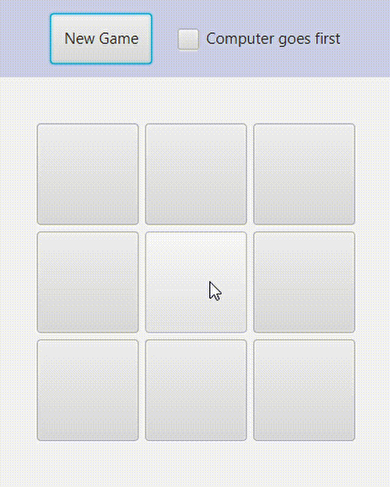

This project implements the Minimax algorithm for an AI-powered Tic-Tac-Toe game. The application follows the **Model-View-Controller (MVC)** pattern and is structured into three main packages:
- **Model**: Defines the game logic and data structures.
    - `PlayField`: Represents a 3×3 Tic-Tac-Toe board. This board consists of `CellState`'s:
    - `CellState`: An `enum` with three possible states: `X`, `O`, and `NP` (empty).
- **Logic**: Implements the **Minimax** algorithm for optimal AI decision-making.
- **View**: Handles the user interface.

### 🤖 Minimax Algorithm
The **Minimax** algorithm is a decision-making strategy used in turn-based games like Tic-Tac-Toe. It works by simulating all possible future moves and evaluating the best possible outcome for the AI.

It maximizes its own score (**Max**) and in the next turn it simulates an opponent, that minimizes the AI's score (**Min**). Algorithm then recursively explores the game tree until it reaches a terminal state (win, loss, or draw). The AI chooses the move that leads to the best worst-case scenario.

This approach ensures that the algorithm always makes the **optimal** move.

